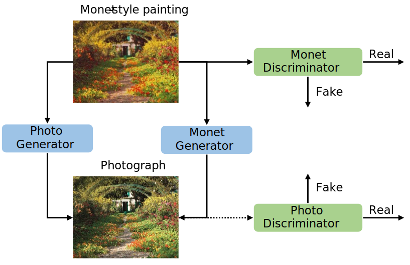
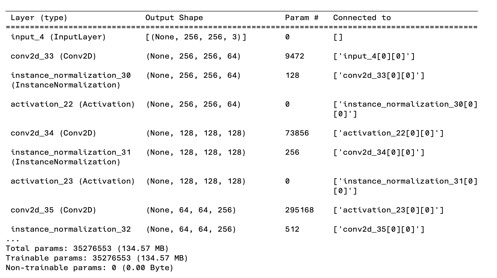
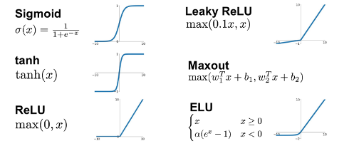
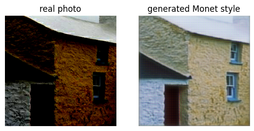

# Training for Monet-Style Image Translation

## Project Overview

This project is part of the [I'm Something of a Painter Myself](https://www.kaggle.com/competitions/gan-getting-started/overview) Kaggle competition, which explores the capabilities of Generative Adversarial Networks (GANs) in replicating the artistic style of Claude Monet. The competition challenges participants to generate thousands of Monet-style images, focusing on GAN training, hyperparameter optimization, and data preprocessing.
<p align="center">
  
</p>

## Abstract

In this study, we adapted the CycleGAN_Monet framework by incorporating a change to the activation functions, transitioning from LeakyReLU and ReLU to Exponential Linear Unit (ELU). Our modification aimed to explore alternative nonlinearities and their impact on discriminator performance within the adversarial training paradigm. While ELU offers potential benefits such as improved gradient propagation and faster convergence during training, our experimentation revealed nuanced insights into its effects on GAN training dynamics.

<p align="center">
  
</p>

## Problem Definition

The competition aims to explore the capabilities of GANs in replicating Claude Monet's unique artistic style. Participants are tasked with developing GAN models capable of generating 7,000 to 10,000 Monet-style images, encapsulating Monet's artistic essence. Beyond artistic implications, successful GAN models could have applications in digital art synthesis, style transfer, and content generation.

## Methods

### Data Preprocessing

1. **Checking Image Dimensions**: Ensure all Monet paintings and photographs have consistent dimensions of 256x256 pixels with 3 color channels (RGB).
2. **Defining Image Parameters**: Define image size, channels, and shape for processing.
3. **Loading Images and Preprocessing**: Load images, convert to arrays, and scale pixel values to [-1, 1].

### Model Architecture

The model architecture comprises two GANs, each with a generator and a discriminator. The generators utilize a CycleGAN architecture with downsampling, upsampling, and ResNet blocks. The discriminator uses a PatchGAN approach to evaluate image realism at the patch level.

<p align="center">
  
</p>

### Training Process

Training involves composite models combining generators and discriminators, incorporating adversarial, identity, forward cycle, and backward cycle losses. Training was performed over 2 epochs with a batch size of 1 sample.

### Evaluation

The composite loss function guides the training of generator models, ensuring fidelity, identity preservation, and consistency in image translation.

## Changes to Original Architecture

### Activation Function

We replaced LeakyReLU and ReLU with ELU, which introduces negative values and can improve gradient propagation and convergence. This change aimed to explore its impact on GAN training dynamics.

<p align="center">
  
</p>

## Results

The original model showed stable generator and discriminator losses, while the modified model exhibited fluctuations and higher losses, indicating potential challenges in convergence due to the ELU activation function.

<p align="center">
  
</p>

## Lessons Learned

1. **Activation Function Impact**: The switch to ELU introduced notable changes in model behavior, highlighting the importance of understanding activation functions.
2. **Training Dynamics**: ELU's introduction posed challenges such as increased model instability, emphasizing careful experimentation and tuning.
3. **Complexity of GAN Training**: The interplay between generators and discriminators requires fine-tuning hyperparameters and training strategies.

## Conclusion

This study provides valuable insights into the impact of activation functions on GAN training dynamics. By integrating these insights, we can advance GAN capabilities for creative expression and computational innovation.

## Project Structure
```
src/
├── constants.py
├── data_loader.py
├── inference.py
├── main.py
├── models
│   ├── __init__.py
│   ├── composite_model.py
│   ├── discriminator.py
│   └── generator.py
├── training.py
├── utils.py
└── losses_elu.xlsx
```

## References

1. Amy Jang, P.C.A.S.U., I’m Something of a Painter Myself. [Kaggle Competition](https://www.kaggle.com/competitions/gan-getting-started/overview)
2. Dubey, S.R., Singh, S.K., Chaudhuri, B.B., Activation functions in deep learning: A comprehensive survey and benchmark. Neurocomputing, 2022.
3. Clevert, D.-A., Unterthiner, T., Hochreiter, S., Fast and accurate deep network learning by exponential linear units (elus). arXiv preprint arXiv:1511.07289, 2020.